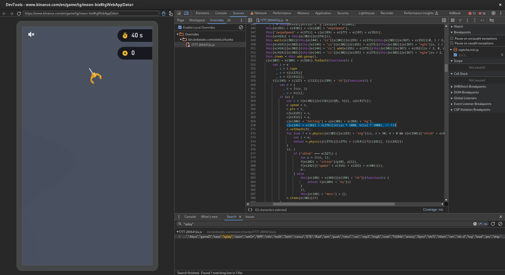

# Moonbix

**Important: Files may change daily!**

1. Activate Webview Inspecting in Telegram by navigating to **Advanced > Experimental settings > Enable webview inspecting**.
2. Play the first time the game to load chunk files.
3. Use the global search to find “setDi” in the chunk file, for example, **chunk-2258.138ed996.js**, which is actually always the first file in the search.
4. Then, in the chunk file, find the line that appears in the image.
5. Save the file for overrides.
6. Change the values to suit your needs.
7. Reload the app to apply the override files.